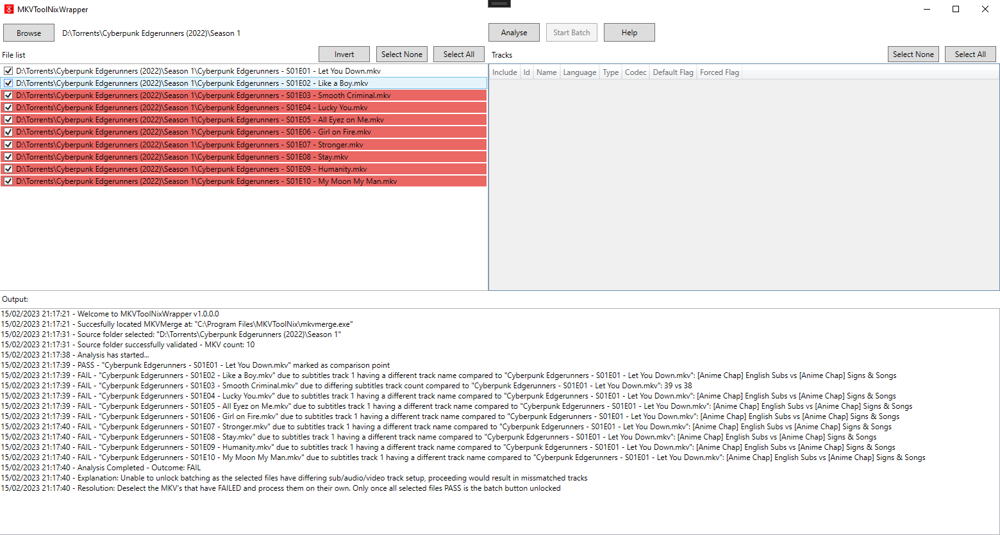
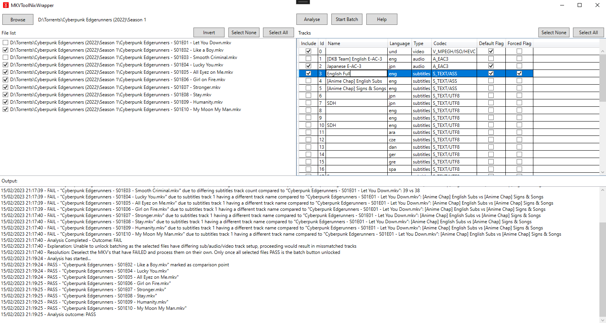
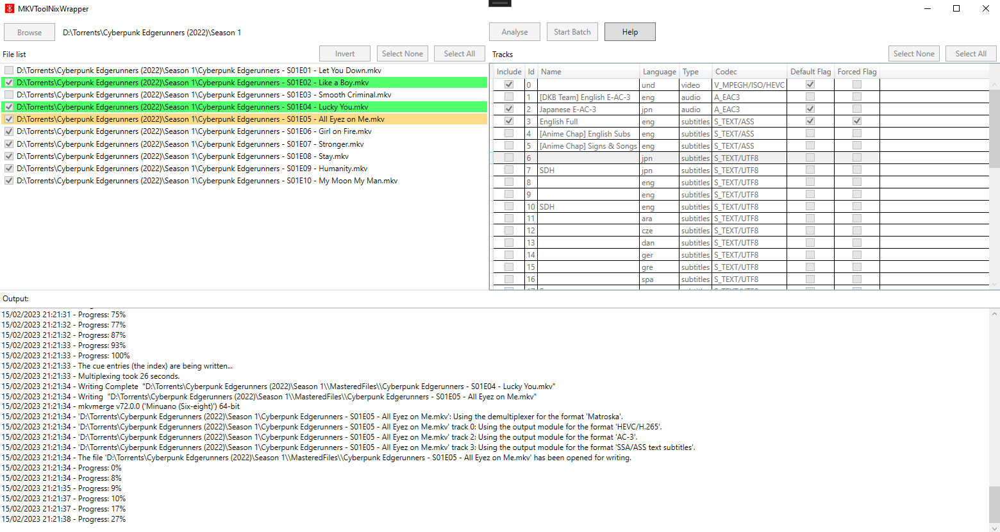

# MKVToolNixWrapper
Facilitates quick bulk editing of .MKV files, allowing you to edit audio, video and subtitle tracks. Editing includes removal of tracks, defaulting tracks, forcing tracks, renaming tracks and setting track language. 

# Download
[Download the latest MKVToolNixWrapper](https://github.com/H3X1C/MKVToolNixWrapper/releases)

Changelogs and all releases are provided in the releases section. Do not try to install using the Code .zip source code button GitHub shows.

# Screenshots

# Example scenario
You have a series of anime that has multiple audio tracks with english dub as the default audio track, the show also has multiple subtitle tracks including english, french and Polish but non of these subtitles are flagged as forced or default so must be enabled manually each time you open an episode.
Using MKVToolNix Wrapper you can quickly remove the tracks you don't want such as the English dub audio track, the French and Polish subtitles. We can also set the default and forced flags if desired for the english subtitle track.
The end result would be a reduced file size and the convenience of opening the file in your chosen player and it automatically defaulting to your own personal preference of subtitles and audio.